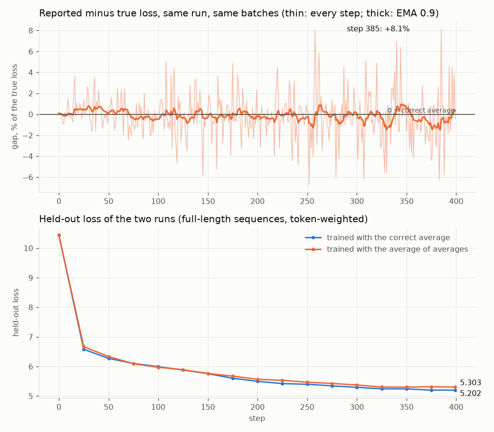
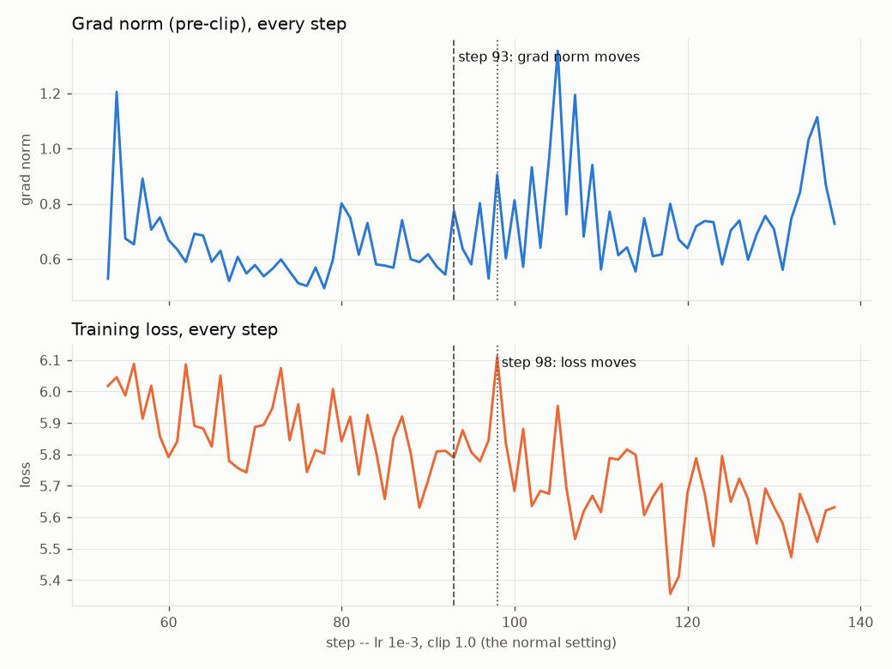

# ERA V5 · Session 10 — making a training loop tell the truth

A small GPT and a real training loop, instrumented until every claim in the session can be checked rather than believed. Every number on this page came out of `training_loop.py`. `run.log` is the transcript of the run and `results.json` is the same numbers machine-readable; this file is generated from that JSON by `make_readme.py`.

```bash
python training_loop.py            # the full run: run.log, results.json, figures/
python training_loop.py --quick    # same structure, fewer steps, no torch.compile
python training_loop.py --replot   # redraw figures/ from results.json
python make_readme.py              # regenerate this file
```

**Setup:** seed `20260829` (the session date), tiny Shakespeare via GPT-2 BPE (V = 50,257), a 4-layer pre-norm GPT at D = 256 (15,915,520 parameters, 3,016,960 outside the embeddings), torch 2.12.1+cu130 on an NVIDIA GeForce RTX 4050 Laptop GPU. The notebook [`training_loop.ipynb`](training_loop.ipynb) runs the same functions cell by cell.

| file | what |
|---|---|
| [`training_loop.py`](training_loop.py) | the harness — one function per requirement |
| [`model.py`](model.py) | the Session 9 GPT, with one fix found by requirement 2 |
| [`training_loop.ipynb`](training_loop.ipynb) | the notebook version, with outputs |
| [`run.log`](run.log) | full transcript of the run below |
| [`results.json`](results.json) | every number, machine-readable |
| [`figures/`](figures) | the two plots |

## The six answers

| # | requirement | result |
|---|---|---|
| 1 | every tensor shape, with what each dimension means | 31 tensors traced through one step, the hand-unrolled forward asserted equal to `model()` |
| 2 | verify one gradient by hand | first attempt **failed** (relative error 0.28); cause found in `RMSNorm`; after the fix, nudge and `backward()` agree to **7 significant figures** |
| 3 | break gradient accumulation on purpose | reported loss off by up to **8.1%** on a single step; the model trained on it ends **0.101 nats worse** held-out; with equal lengths the gap is exactly 0 |
| 4 | a step where the grad norm moved before the loss | step **93**, in the normal setting; the loss followed 5 steps later. Thin evidence — see below |
| 5 | MFU, honestly | **24.0%** for the model as specified; **48.3%** for the same code on a 4x wider model. What costs the distance: only 27% of GPU time is matmul |
| 6 | 0.1 in fp32, bf16, fp8 E4M3, by hand | `0x3DCCCCCD`, `0x3DCD`, `0x1D`; all three match what the hardware formats produce. Train in **bf16** |

## 1. Every tensor shape in one step

One micro-batch of B = 4 sequences × T = 64 positions, walked through by hand. Block 0 is unrolled — attention included — and the result is asserted equal to the module's own output, so the shapes below are the shapes the model actually computes, not a diagram of them.

| tensor | shape | what each dimension means |
|---|---|---|
| `idx` | `(4, 64)` | [B=4 sequences, T=64 positions] token ids |
| `targets` | `(4, 64)` | [B, T] the id that should come next at each position |
| `tok_emb = wte[idx]` | `(4, 64, 256)` | [B, T, D=256] one D-vector per token (a row lookup, no FLOPs) |
| `pos_emb = wpe[0..T-1]` | `(64, 256)` | [T, D] one vector per position, broadcast over B |
| `x = tok_emb + pos_emb` | `(4, 64, 256)` | [B, T, D] the residual stream entering block 0 |
| `h = RMSNorm(x)` | `(4, 64, 256)` | [B, T, D] same shape; each token vector rescaled to unit RMS |
| `qkv = h @ W_qkv^T` | `(4, 64, 768)` | [B, T, 3D=768] query, key and value side by side |
| `q` | `(4, 4, 64, 64)` | [B, H=4 heads, T, Dh=64] D split into H heads of Dh |
| `k` | `(4, 4, 64, 64)` | [B, H, T, Dh] one key per head per position |
| `v` | `(4, 4, 64, 64)` | [B, H, T, Dh] one value per head per position |
| `scores = q k^T / sqrt(Dh)` | `(4, 4, 64, 64)` | [B, H, T queries, T keys] every position scored against every other |
| `attn = softmax(masked scores)` | `(4, 4, 64, 64)` | [B, H, T, T] each row sums to 1; the future is masked to 0 |
| `y = attn @ v` | `(4, 4, 64, 64)` | [B, H, T, Dh] per head, a weighted mix of values |
| `concat heads` | `(4, 64, 256)` | [B, T, D] heads laid back side by side |
| `W_O @ concat` | `(4, 64, 256)` | [B, T, D] the output projection; this is what mixes the heads |
| `x = x + attn_out` | `(4, 64, 256)` | [B, T, D] residual add |
| `gate(h), up(h)` | `(4, 64, 640)` | [B, T, F=640] FFN width, 8/3 D rounded down to a multiple of 64 |
| `silu(gate) * up` | `(4, 64, 640)` | [B, T, F] the SwiGLU product |
| `x = x + down(...)` | `(4, 64, 256)` | [B, T, D] back to model width, residual add; block 0 done |
| `x after all 4 blocks` | `(4, 64, 256)` | [B, T, D] the stream, unchanged in shape by every block |
| `logits = norm_f(x) @ W_head^T` | `(4, 64, 50257)` | [B, T, V=50257] one score per vocabulary entry per position |
| `logits.view(B*T, V)` | `(256, 50257)` | [B*T=256, V] every position becomes one classification row |
| `loss` | `()` | [] one scalar: the mean over all B*T=256 predictions |
| `grad wte.weight = lm_head.weight (tied)` | `(50257, 256)` | [V rows, D] one row per token; gets gradient from the lookup AND the head |
| `grad wpe.weight` | `(128, 256)` | [block_size=128, D] only the first T=64 rows got nonzero gradient |
| `grad blocks.0.attn.qkv.weight` | `(768, 256)` | [out=3D, in=D] nn.Linear stores [out, in] |
| `grad blocks.0.attn.proj.weight` | `(256, 256)` | [out=D, in=D] W_O |
| `grad blocks.0.ffn.down.weight` | `(256, 640)` | [out=D, in=F] |
| `grad blocks.0.n1.g` | `(256,)` | [D] one gain per channel |
| `exp_avg (m), qkv.weight` | `(768, 256)` | [3D, D] running mean of the gradient |
| `exp_avg_sq (v), qkv.weight` | `(768, 256)` | [3D, D] running mean of the squared gradient |

Two things the table makes visible. `wte` is one matrix doing two jobs — the lookup at the input and, tied, the `V × D` output head — so it collects gradient from both ends. And only the first T = 64 rows of the positional table received any gradient (64 of 128 rows got exactly zero): a position the batch never used cannot learn anything that step. The untrained loss is 10.8616 against ln V = 10.8249, as it should be.

## 2. One gradient, verified by hand — and what the first attempt found

Weight `blocks.1.ffn.up.weight[5,17]`. Nudge it up and down, measure the loss each time, take the slope, compare it with what `backward()` stored in `.grad`.

**The first attempt did not agree.** With the model exactly as Session 9 left it, in fp64, a central difference at ε = 1e-6 gave `+0.003061712661` against `backward()`'s `+0.004259130001` — a relative error of 0.28, where fp64 should manage about 1e-9. The error also *grew* as ε shrank, which is the signature of lost precision rather than of a wrong derivative.

The cause was one line of `RMSNorm`: `x.float()`. For a bf16 model that is an upcast, which is why it was written. For an fp64 model it is a silent **downcast** to fp32 inside every norm, so the "fp64" loss carried only fp32's seven digits and the finite difference was mostly rounding noise. Nothing raised an error; the model trained perfectly well in both sessions. The fix promotes instead of casting — `x.to(torch.promote_types(x.dtype, torch.float32))` — which is an upcast for bf16 and a no-op for fp64.

**After the fix:** `backward()` in fp64 gives `+0.004259130307`; the nudge gives `+0.004259130826`. Absolute difference 5.2e-10, relative 1.2e-07 — **7 significant figures**. `backward()` in fp32 gives `+0.004259136040`.

The same check across nudge sizes shows why a careless version fails even with a correct model (relative error against the fp64 `backward()`):

| ε | fp64 central | fp64 forward | fp32 central | fp32 forward |
|--:|--:|--:|--:|--:|
| 1e-01 | 7.6e-06 | 4.3e-03 | 7.6e-07 | 4.2e-03 |
| 1e-02 | 7.6e-08 | 4.3e-04 | 4.4e-05 | 2.9e-04 |
| 1e-03 | 7.2e-10 | 4.3e-05 | 1.3e-03 | 3.2e-03 |
| 1e-04 | 9.4e-10 | 4.3e-06 | 1.6e-02 | 3.2e-02 |
| 1e-05 | 3.2e-09 | 4.6e-07 | 1.4e-01 | 2.9e-01 |
| 1e-06 | 1.2e-07 | 8.7e-08 | 3.2e+00 | 1.8e+00 |
| 1e-07 | 3.0e-06 | 3.0e-06 | 3.2e+01 | 2.9e+01 |
| 1e-08 | 9.5e-06 | 9.5e-06 | 9.1e+01 | 9.8e+01 |

Two errors pull in opposite directions. **Truncation**: a finite difference is only the slope of a straight line, so a large ε includes curvature — the forward difference is off in proportion to ε, the central one to ε². **Rounding**: a small ε makes the loss change so small that it falls into the last digits the format keeps. In fp64 the best agreement sits near ε = 1e-3 to 1e-4; in fp32 the rounding floor arrives so early that every ε below 1e-2 gets worse, and at 1e-6 the fp32 answer is off by more than 100%. The rule that falls out: check gradients in fp64, with a central difference, at an ε near the cube root of the format's precision.

## 3. Gradient accumulation, broken on purpose

Four micro-batches of 8 sequences per step. Each micro-batch keeps only 8, 16, 32, 64 or 128 of its 128 positions in the loss (the rest are padding), drawn at random, so the token counts differ step to step. Two runs of 400 steps from the same initialisation, on the same data in the same order:

- **correct** — sum every token's loss across the step, divide by all the valid tokens in the step
- **buggy** — average each micro-batch over its own tokens, then average the four averages



**The reported loss.** On the same batches, the average of averages differs from the true loss by 1.50% on average and by as much as 8.1% on one step (step 385). It is not a bias you would spot on a dashboard: step to step it swings both ways, and its moving average stays within about ±1%.

**The model.** The damage is in the gradient, not the log. A short micro-batch's few tokens get the same vote as a long one's many, so the buggy run over-weights whatever short micro-batches contain — here, only early positions. It ends worse on held-out data:

| step | correct | buggy | early positions 0–15, correct / buggy | late positions 64–127, correct / buggy |
|--:|--:|--:|--:|--:|
| 0 | 10.4350 | 10.4384 | 10.478 / 10.460 | 10.425 / 10.435 |
| 100 | 5.9924 | 5.9712 | 6.076 / 6.043 | 5.922 / 5.899 |
| 200 | 5.4980 | 5.5660 | 5.638 / 5.605 | 5.426 / 5.522 |
| 300 | 5.2939 | 5.3736 | 5.388 / 5.438 | 5.235 / 5.335 |
| 399 | 5.2017 | 5.3025 | 5.229 / 5.333 | 5.160 / 5.263 |

Early on the buggy run is slightly *better* at early positions — it was trained harder on them — and by the end it is worse everywhere, 0.101 nats behind overall.

**How it hid.** The same comparison with all four micro-batches at full length: losses 10.848073 and 10.848073, a difference of exactly 0, and gradients 2.2e-08 apart (floating-point summation order). When token counts are equal the two formulas are the same formula, which is the case casual testing tends to exercise.

## 4. The grad norm, every step — and a step where it moved first

The grad norm is logged before clipping, every step (`clip_grad_norm_` returns the pre-clip value). "Moved" is defined before looking, so the answer cannot be picked by eye: a series moves at step *s* when it sits ≥ 4 robust standard deviations above its own last 20 steps (rolling median and MAD). The search wants a step where the grad norm moves **up** while the loss is still quiet (< 2), and the loss then moves up (≥ 3) within 10 steps. The first 50 steps are skipped, since everything moves then. Full-length batches, so per-step loss noise is not batch shape.

Found in **lr 1e-3, clip 1.0 (the normal setting)** — no need to turn the guard-rails off to see one:



| step | grad norm | loss | |
|--:|--:|--:|---|
| 90 | 0.617 | 5.7166 |  |
| 91 | 0.573 | 5.8092 |  |
| 92 | 0.543 | 5.8116 |  |
| 93 | 0.774 | 5.7892 | grad norm moves |
| 94 | 0.637 | 5.8771 |  |
| 95 | 0.580 | 5.8071 |  |
| 96 | 0.802 | 5.7780 |  |
| 97 | 0.529 | 5.8448 |  |
| 98 | 0.905 | 6.1118 | loss moves |
| 99 | 0.603 | 5.8359 |  |
| 100 | 0.813 | 5.6836 |  |

At step 93 the grad norm jumps to z = +4.4 while the loss sits at z = -0.2; the loss follows at step 98 (z = +4.8).

**How much this is worth.** Across the run the grad norm spiked 10 times. A loss spike followed within 10 steps after 20% of them, against 3% for any 10-step window — so a grad-norm spike does raise the odds of a loss spike. But that rests on a handful of events in a 400-step run of a small model, and in the plot the grad norm also rises at the very step the loss spikes. What this run supports is the modest claim: the grad norm is the earlier and cleaner of the two signals, not a reliable forecast.

## 5. MFU, measured honestly

**The denominator.** A laptop part's datasheet peak depends on its power limit, so the peak here is measured: the best of five timed windows of an 8192³ matmul after a two-second warm-up — **21.5 TFLOP/s in bf16** (fp32: 5.3). Every MFU below divides by the bf16 figure, including the fp32 row: MFU asks what share of the machine you are paying for is doing model arithmetic, and dividing fp32 by an fp32 peak would flatter it.

**The numerator.** Two counts. The brief's `6N` uses every parameter. The exact count uses only the weights that take part in a matmul (the embedding lookup costs nothing; the tied head is a real V × D matmul, so it counts), plus attention's own score and value matmuls, 12·L·T·D.

| variant | tokens/s | MFU (6N) | MFU (exact) |
|---|--:|--:|--:|
| fp32, eager | 35,084 | 15.6% | 15.8% |
| bf16 autocast, eager | 50,910 | 22.6% | 22.9% |
| bf16, torch.compile | 53,231 | 23.6% | 24.0% |
| bf16, compile, 4x wider model (D=768, 8 layers) | 17,596 | 46.8% | 48.3% |

Where the GPU time goes for the model as specified (bf16, share of CUDA kernel time):

| kernels | share |
|---|--:|
| elementwise, norms, casts, copies | 32.9% |
| softmax / cross-entropy over V | 29.4% |
| matmul kernels | 27.2% |
| optimizer + grad clipping | 9.3% |
| attention kernels | 0.9% |
| embedding lookup / scatter | 0.2% |

**What costs the distance to 40%.** The model is too narrow for this GPU. At D = 256 the matmuls are small, so only 27% of GPU time is spent in them. The rest goes to work that moves memory rather than doing arithmetic: the softmax and cross-entropy over 50,257 vocabulary entries at every position (29%), and the norms, casts and elementwise ops (33%). `torch.compile` fuses some of the latter and buys a point. The test of that diagnosis is the last row: the same code on a model four times wider reaches **48.3%** — past 40% — because now the matmuls are big enough to dominate. The loop is not what is slow; the shape is.

## 6. 0.1 in fp32, bf16 and fp8 E4M3, by hand

0.1 = 1.6 × 2⁻⁴, so every format stores the exponent −4 and has to approximate the 0.6. In binary 0.6 is 0.1001 1001 1001 … and repeats forever, so every format rounds; the only question is where. Rounding is to nearest, ties to even, done in exact arithmetic (`fractions.Fraction`) and then checked against the bits the real formats produce.

| format | layout | exponent field | mantissa (0.6 × 2ᵐ → rounded) | bits | value | error |
|---|---|---|---|---|--:|--:|
| fp32 | 1 · 8 · 23, bias 127 | −4 + 127 = 123 = `01111011` | 5033164.8 → 5033165 = `10011001100110011001101` | `0 01111011 10011001100110011001101` (`0x3DCCCCCD`) | 0.10000000149 | 1.49e-06% |
| bf16 | 1 · 8 · 7, bias 127 | −4 + 127 = 123 = `01111011` | 76.8 → 77 = `1001101` | `0 01111011 1001101` (`0x3DCD`) | 0.10009765625 | 0.0977% |
| fp8 E4M3 | 1 · 4 · 3, bias 7 | −4 + 7 = 3 = `0011` | 4.8 → 5 = `101` | `0 0011 101` (`0x1D`) | 0.1015625 | 1.56% |

All three agree bit for bit with `struct.pack('>f', 0.1)`, `torch.bfloat16` and `torch.float8_e4m3fn`.

**Which I would train in: bf16**, with fp32 master weights and optimizer state. The table is the argument. bf16 keeps fp32's eight exponent bits, so it reaches every magnitude a gradient will take and needs no loss scaling; it pays in precision (0.1% error here), which the fp32 master copy absorbs at the update. fp8 E4M3 is already 1.6% off on a number as ordinary as 0.1, and with four exponent bits its range tops out at 448 — it only works with a scale factor per tensor or per block, and even then only inside the matmuls, not for the weights the optimizer writes to. Requirement 5 settles the rest for this model: its time is not in the matmuls, so the one thing fp8 would speed up is not what is slow.

---

Run: 380 s on an NVIDIA GeForce RTX 4050 Laptop GPU, torch 2.12.1+cu130, seed 20260829.
