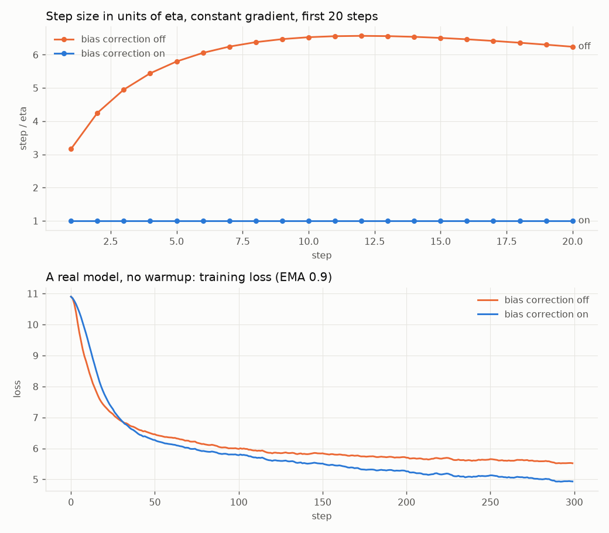
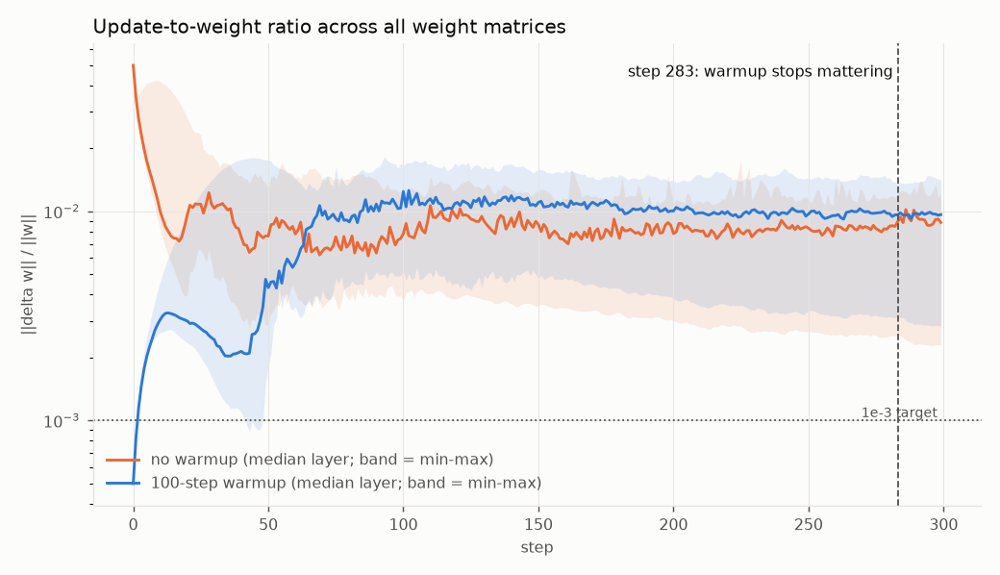
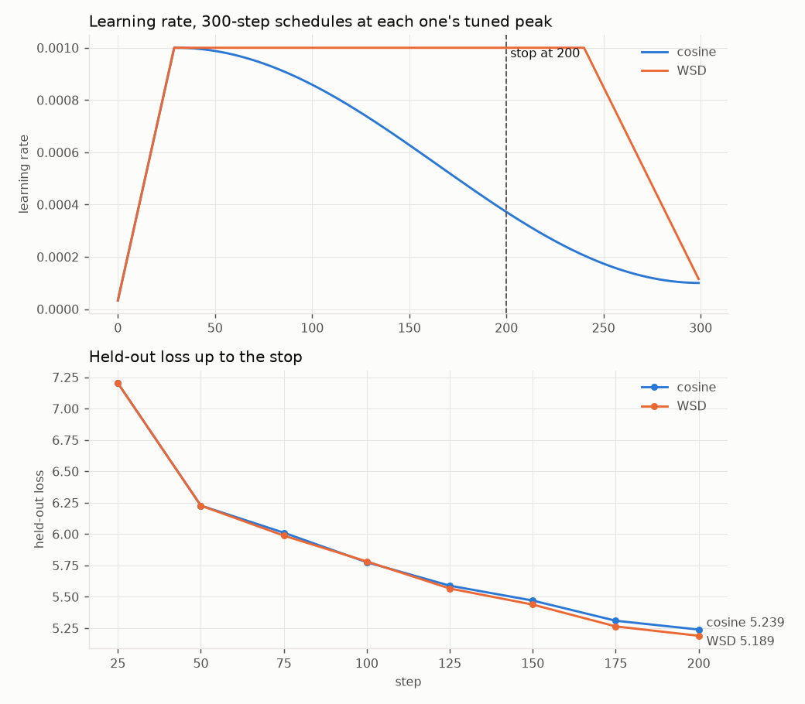
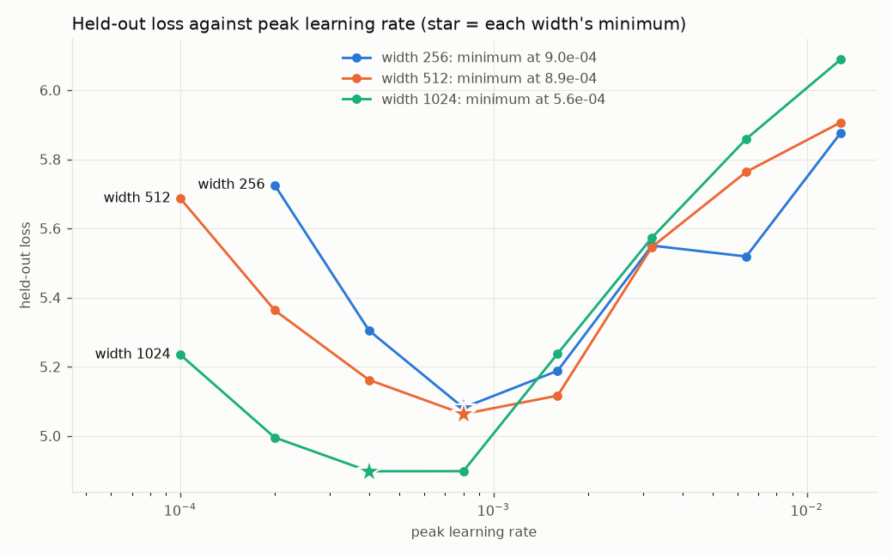

# ERA V5 · Session 11 — optimizers and learning-rate schedules, measured

Adam computed by hand and checked against PyTorch; bias correction switched off; the update-to-weight ratio of every layer; cosine against WSD with both sides tuned; and a learning-rate sweep across three widths with a call for a fourth. Every number on this page came out of `optimizers.py`: [`run.log`](run.log) is the transcript, [`results.json`](results.json) the numbers, and this file is generated from that JSON by `make_readme.py`.

```bash
python optimizers.py            # the full run: run.log, results.json, figures/
python optimizers.py --quick    # same structure, fewer points
python optimizers.py --replot   # redraw figures/ from results.json
python make_readme.py           # regenerate this file
```

**Setup:** seed `20260905` (the session date), tiny Shakespeare via GPT-2 BPE (V = 50,257), a 4-layer pre-norm GPT (D = 256 unless the width is the variable), batch 16 × 128, AdamW with decay 0.1 on matrices and none on norm gains, clipping at 1.0, torch 2.12.1+cu130 on an NVIDIA GeForce RTX 4050 Laptop GPU. The notebook [`optimizers.ipynb`](optimizers.ipynb) runs the same functions cell by cell.

## The five answers

| # | requirement | result |
|---|---|---|
| 1 | Adam by hand, checked against PyTorch | agrees to 1e-16 in fp64 and 1e-8 in fp32; all 30 of 30 values in the brief's own table reproduce |
| 2 | when bias correction stops mattering | the uncorrected step is **6.57× too large** at step 12, within 10% only by step **1,751** and 1% by **3,925** — not within twenty steps. A real model trained without it ends 0.55 nats worse |
| 3 | the step at which warmup stops changing the update-to-weight ratio | **step 283**, against a 100-step warmup — the effect outlasts the warmup by 183 steps |
| 4 | cosine against WSD, stopped at 200 | both tuned; **WSD 5.1894** against cosine 5.2390. Keep WSD — and give it a 20-step decay: 5.1162 |
| 5 | the learning rate at width 4,096 | **3.8e-04**, with a range of 2.3e-04 to 5.4e-04. Low confidence — see why |

## 1. Adam by hand

One weight starting at 1.0, five gradients (0.50, 0.40, 0.60, 0.45, 0.55), η = 0.001, β₁ = 0.9, β₂ = 0.999, ε = 1e-8 — the brief's Section 6 example, so the result can be checked against the brief as well as against PyTorch. Computed in plain Python floats:

```
m      = β₁·m + (1 − β₁)·g                  running mean of the gradient: the direction
v      = β₂·v + (1 − β₂)·g²                 running mean of the squared gradient: the scale
m̂      = m / (1 − β₁ᵗ)                      bias correction: both averages start at 0 and read low
v̂      = v / (1 − β₂ᵗ)
step   = −η · m̂ / (√v̂ + ε)
```

| t | g | m | v | m̂ | v̂ | step | w |
|--:|--:|--:|--:|--:|--:|--:|--:|
| 1 | 0.50 | 0.050000 | 0.000250000 | 0.500000 | 0.250000 | -0.001000000 | 0.999000000 |
| 2 | 0.40 | 0.085000 | 0.000409750 | 0.447368 | 0.204977 | -0.000988126 | 0.998011874 |
| 3 | 0.60 | 0.136500 | 0.000769340 | 0.503690 | 0.256703 | -0.000994140 | 0.997017734 |
| 4 | 0.45 | 0.167850 | 0.000971071 | 0.488078 | 0.243132 | -0.000989847 | 0.996027887 |
| 5 | 0.55 | 0.206065 | 0.001272600 | 0.503199 | 0.255030 | -0.000996425 | 0.995031463 |

Checked against `torch.optim.Adam`, reading `exp_avg` and `exp_avg_sq` out of its state after every step (largest difference over the five steps):

| | m | v | m̂ | v̂ | step | w |
|---|--:|--:|--:|--:|--:|--:|
| float64 | 2.8e-17 | 2.2e-19 | 1.1e-16 | 5.6e-17 | 4.8e-17 | 0.0e+00 |
| float32 | 2.6e-09 | 7.2e-11 | 7.7e-09 | 1.5e-08 | 1.4e-08 | 1.3e-08 |

In fp64 the two agree to the last bit or within 1e-16. In fp32 they agree to about 1e-8, which is fp32's own resolution. The step column shows why Adam became the default: the gradients range from 0.40 to 0.60, and every step is within half a percent of η. The gradient decides the direction and η decides the distance.

## 2. Bias correction switched off



Both running averages start at zero, so early on they read low: after t steps of a constant gradient g, m = g(1 − β₁ᵗ) and v = g²(1 − β₂ᵗ). Bias correction divides those factors back out. Without it the step is η · (1 − β₁ᵗ) / √(1 − β₂ᵗ): the first factor shrinks the step, the second inflates it, and because β₂ = 0.999 is so much closer to 1 than β₁ = 0.9, the inflation wins for a long time.

| step | 1 | 2 | 3 | 5 | 10 | 15 | 20 |
|---|--:|--:|--:|--:|--:|--:|--:|
| corrected, step / η | 1.000 | 1.000 | 1.000 | 1.000 | 1.000 | 1.000 | 1.000 |
| uncorrected, step / η | 3.162 | 4.250 | 4.950 | 5.797 | 6.528 | 6.507 | 6.241 |

**When does the difference stop mattering? Not within twenty steps.** The uncorrected step peaks at 6.57η at step 12, and is still 6.2η at step 20. It comes back within 50% of the corrected step at step 588, within 10% at step 1,751, and within 1% at step 3,925.

That ratio is not an artefact of a constant gradient. Both versions divide the same m by the same √v, so for *any* gradient sequence the uncorrected update differs from the corrected one by exactly that factor, step for step (ε aside). The crossing points above hold for every run with these β's.

**What it does to a real model.** The switchable optimizer was checked first: 20 steps against `torch.optim.AdamW` agree to 9e-05 in loss. Then the same model, same data, 300 steps, with and without correction:

| | final held-out loss, corrected | uncorrected | largest gap in training loss |
|---|--:|--:|--:|
| no warmup | 5.2329 | 5.7793 | 12.0% |
| 30-step warmup | 4.9312 | 5.6046 | 19.8% |

The curves never come back within 1% inside the run, because at step 300 the uncorrected run is still stepping about 2× too far. Warmup does not rescue it: it shrinks the first steps, but the multiplier outlives a 30-step warmup by thousands of steps.

## 3. The update-to-weight ratio, every layer

For every weight matrix, every step: ‖Δw‖ / ‖w‖ — how far the step moved the weights, as a fraction of their size. Two runs, identical except that one warms the learning rate up linearly over 100 steps.



**Without warmup the first step is huge**: 5.03e-02 on every layer, which is η / 0.02 — Adam moves each weight by about η, and the weights start at a scale of 0.02. With warmup the largest ratio anywhere is 1.84e-02, 2.7× smaller. This is the brief's argument in numbers: early gradients all agree, so every weight takes Adam's full step at once, and warmup is what keeps that from happening at full learning rate.

**When warmup stops changing it: step 283.** For each layer, take the ratio in the warmup run divided by the ratio in the no-warmup run, smoothed with a 9-step rolling median; take the median over all 22 layers; find the step after which it stays within 10% of 1. The two runs' weights drift apart for reasons that have nothing to do with warmup, so a single layer can differ forever — which is why the rule uses the median across layers. 9 of 22 layers also pass it on their own.

Warmup ended at step 100; its effect on the ratio lasted to step 283. After it the ratios settle near 1e-2 — ten times the brief's 1e-3 guide, which is expected for a model this small at this learning rate, and is itself the kind of number the brief says to log from step one.

| layer | max, no warmup | max, warmup | last 20 steps | warmup stops mattering |
|---|--:|--:|--:|--:|
| `wte.weight` | 4.92e-02 | 1.80e-02 | 2.95e-03 | not within the run |
| `wpe.weight` | 5.02e-02 | 1.84e-02 | 1.40e-02 | not within the run |
| `blocks.0.attn.qkv.weight` | 5.01e-02 | 1.66e-02 | 1.03e-02 | not within the run |
| `blocks.0.attn.proj.weight` | 5.01e-02 | 1.29e-02 | 1.19e-02 | not within the run |
| `blocks.0.ffn.gate.weight` | 4.99e-02 | 1.45e-02 | 9.78e-03 | not within the run |
| `blocks.0.ffn.up.weight` | 5.00e-02 | 1.41e-02 | 9.66e-03 | not within the run |
| `blocks.0.ffn.down.weight` | 4.99e-02 | 1.44e-02 | 9.98e-03 | not within the run |
| `blocks.1.attn.qkv.weight` | 4.99e-02 | 1.54e-02 | 8.13e-03 | not within the run |
| `blocks.1.attn.proj.weight` | 4.98e-02 | 7.84e-03 | 6.40e-03 | step 264 |
| `blocks.1.ffn.gate.weight` | 4.99e-02 | 1.29e-02 | 9.39e-03 | not within the run |
| `blocks.1.ffn.up.weight` | 4.99e-02 | 1.27e-02 | 9.45e-03 | not within the run |
| `blocks.1.ffn.down.weight` | 4.98e-02 | 1.42e-02 | 9.20e-03 | not within the run |
| `blocks.2.attn.qkv.weight` | 4.98e-02 | 1.51e-02 | 9.99e-03 | not within the run |
| `blocks.2.attn.proj.weight` | 4.98e-02 | 6.25e-03 | 5.87e-03 | step 292 |
| `blocks.2.ffn.gate.weight` | 5.00e-02 | 1.24e-02 | 9.59e-03 | step 278 |
| `blocks.2.ffn.up.weight` | 4.99e-02 | 1.25e-02 | 9.70e-03 | step 281 |
| `blocks.2.ffn.down.weight` | 5.00e-02 | 1.35e-02 | 9.95e-03 | step 256 |
| `blocks.3.attn.qkv.weight` | 4.96e-02 | 1.66e-02 | 9.83e-03 | not within the run |
| `blocks.3.attn.proj.weight` | 5.03e-02 | 6.90e-03 | 6.57e-03 | step 284 |
| `blocks.3.ffn.gate.weight` | 4.99e-02 | 1.19e-02 | 9.72e-03 | step 237 |
| `blocks.3.ffn.up.weight` | 5.01e-02 | 1.18e-02 | 9.86e-03 | step 273 |
| `blocks.3.ffn.down.weight` | 4.99e-02 | 1.22e-02 | 1.01e-02 | step 230 |

## 4. Cosine against WSD

Both schedules are defined for 300 steps with a 30-step warmup. Cosine decays from its peak to 10% along a cosine; WSD holds its peak and decays linearly over the last 20% (steps 240–300). Both stop at step 200: at that point cosine is at 0.38× its peak and WSD has not started to decay.

**Tune both sides first.** A comparison of two methods at one shared learning rate is a comparison of how well that learning rate suits each of them. So each schedule gets its own sweep:

| peak learning rate | cosine, held-out at 200 | WSD, held-out at 200 |
|--:|--:|--:|
| 5e-04 | 5.3556 | 5.2433 |
| 1e-03 | 5.2390 | 5.1894 |
| 2e-03 | 5.4492 | 5.4614 |
| 4e-03 | 5.7027 | 5.7168 |

Both are best at 1e-03, so the comparison below is at each side's own optimum, not at a learning rate chosen for one of them.



| model | held-out loss |
|---|--:|
| cosine (300-step schedule) stopped at 200 | 5.2390 |
| **WSD (300-step schedule) stopped at 200** | **5.1894** |
| WSD at 200 + a 20-step decay branch | 5.1162 |
| cosine scheduled for exactly 200 steps | 5.3886 |

**The model I would keep is WSD's.** Stopped at step 200 with no more compute, it is ahead by 0.050 nats. Cosine has spent its first 200 steps decaying towards a finish line at 300 that it never reached; WSD spent them at full learning rate. And WSD's real advantage is the next row: the step-200 checkpoint can be decayed on a branch, and 20 more steps take it to 5.1162, better than anything else here. That is the brief's point — WSD does not need to know the length of the run in advance.

One result I did not expect: cosine scheduled for exactly 200 steps is the *worst* model of the four. In a run this short the model is still far from converged, and time spent at a high learning rate is worth more than time spent annealing. That is a statement about this regime — 200 steps of a small model — not about pretraining in general. It is also one seed.

## 5. The learning rate across widths

Widths 256, 512, 1024 (head dimension 64, so 4, 8 and 16 heads), 4 layers, standard parameterization (every weight initialised at std 0.02 regardless of width), 300 steps each with a 30-step warmup and cosine to 10%, and the peak learning rate swept in factors of 2.



| peak learning rate | width 256 | width 512 | width 1024 |
|--:|--:|--:|--:|
| 1.0e-04 | 6.2561 | 5.6865 | 5.2346 |
| 2.0e-04 | 5.7253 | 5.3633 | 4.9954 |
| 4.0e-04 | 5.3048 | 5.1619 | 4.8978 |
| 8.0e-04 | 5.0816 | 5.0633 | 4.8981 |
| 1.6e-03 | 5.1883 | 5.1165 | 5.2379 |
| 3.2e-03 | 5.5504 | 5.5464 | 5.5733 |
| 6.4e-03 | 5.5188 | 5.7636 | 5.8589 |
| 1.3e-02 | 5.8758 | 5.9064 | 6.0882 |

The minimum of each curve is found by fitting a parabola through the best grid point and its two neighbours, in log learning rate:

| width | grid minimum | fitted minimum | loss |
|--:|--:|--:|--:|
| 256 | 8.0e-04 | **9.04e-04** | 5.0816 |
| 512 | 8.0e-04 | **8.87e-04** | 5.0633 |
| 1024 | 4.0e-04 | **5.65e-04** | 4.8978 |

A power law through the three minima gives η* ∝ width^-0.34, which extrapolates to **3.8e-04 at width 4,096**. The two width doublings on their own give exponents of -0.03 and -0.65, which carried to 4,096 span 2.3e-04 to 5.4e-04.

**How confident I am: not very, and the data says so.**

- The two pairwise exponents disagree by a factor of 24 (-0.03 against -0.65). Three points cannot distinguish a power law from noise.
- The minima are shallow. At width 1,024 the losses at 4e-4 and 8e-4 differ in the fourth decimal, so the minimum is pinned down to within a factor of two at best.
- It is one seed, 300 steps, and a 4× extrapolation beyond the widest point.
- The measured exponent, -0.34, is much flatter than the brief's table, which has the optimum falling roughly as 1/width. A likely reason is what these models are made of: at width 256, the 50,257-token embedding is 12.9M of the 15.9M parameters. Theory for Adam under the standard parameterization says the hidden matrices want a learning rate that falls with width but the embedding does not, so a model dominated by its embedding shows a weak dependence overall.

**The value I would use at width 4,096: 3.8e-04** — and I would not trust it without a short sweep around it at the real width. This is exactly the problem muP exists to remove: under muP the minima line up across widths, so a sweep at width 256 gives the answer for 4,096 directly instead of through an extrapolation like this one.

---

Run: 809 s on an NVIDIA GeForce RTX 4050 Laptop GPU, torch 2.12.1+cu130, seed 20260905.
