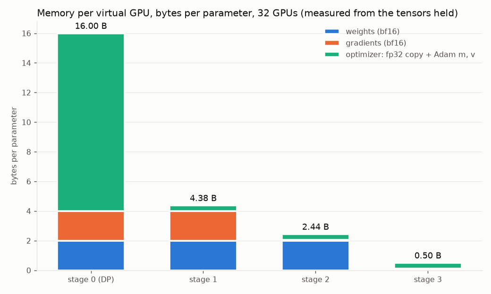
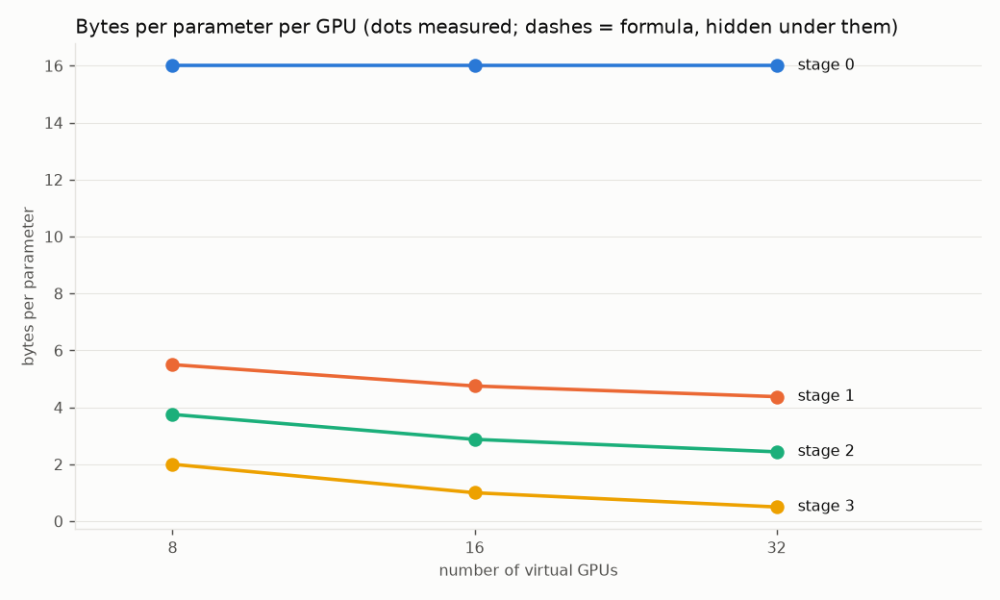
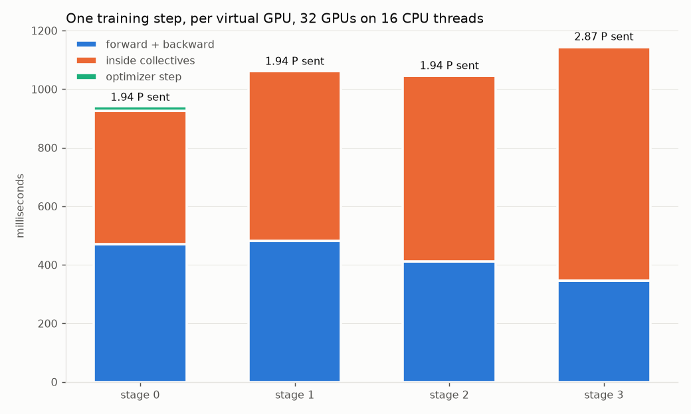

# ERA V5 · Session 12 — ZeRO on 32 virtual GPUs, written out by hand

32 CPU processes stand in for 32 GPUs. They talk through `torch.distributed` (the gloo backend) using the same three collectives a real run uses — all-reduce, reduce-scatter and all-gather. A tiny GPT trains on top of them under data parallelism and under ZeRO stages 1, 2 and 3.

There is no DeepSpeed and no FSDP here. Each stage is a few dozen lines that call the collectives in the right order, so the mechanism is readable in [`zero_sim.py`](zero_sim.py) rather than hidden in a library. Every number on this page came out of one run: [`run.log`](run.log) is its transcript, [`results.json`](results.json) holds the numbers, and this file is generated from that JSON by `make_readme.py`.

```bash
python zero_sim.py            # stages 0-3 at 8, 16 and 32 virtual GPUs, then the single-process check
python zero_sim.py --quick    # 8 virtual GPUs, fewer steps
python make_readme.py         # regenerate this file
```

The notebook [`zero_sim.ipynb`](zero_sim.ipynb) runs the same code cell by cell. Setup: torch 2.12.1+cu130, 16 CPU threads, seed 20260912, 12 steps per run.

## The answer, at 32 GPUs

| | stage 0 (data parallel) | stage 1 | stage 2 | stage 3 |
|---|--:|--:|--:|--:|
| what is split across GPUs | nothing | optimizer state | + gradients | + weights |
| memory per GPU, bytes per parameter (measured) | **16.00** | **4.38** | **2.44** | **0.50** |
| the same, from the formula | 16.00 | 4.38 | 2.44 | 0.50 |
| traffic per GPU per step, in P | 1.938 | 1.938 | 1.938 | 2.868 |
| optimizer step, ms per GPU | 15.47 | 0.93 | 0.98 | 0.92 |
| loss difference from one process on the whole batch | 6.8e-04 | 6.8e-04 | 6.8e-04 | 1.2e-03 |

P is the size of the whole model in bf16: 418,048 parameters × 2 bytes = 836,096 bytes. In one sentence: **each stage stops keeping one more thing on every GPU, memory falls from 16 bytes a parameter to 0.50, stages 1 and 2 send exactly what data parallelism already sends, stage 3 sends half as much again — and the model learns exactly the same thing in all four.**

## Why 16 bytes a parameter

Training in bf16 with Adam keeps five numbers for every weight:

| what | format | bytes | why it is there |
|---|---|--:|---|
| the weight used for arithmetic | bf16 | 2 | the forward and backward passes run on it |
| its gradient | bf16 | 2 | backward writes it; the optimizer reads it |
| a master copy of the weight | fp32 | 4 | adding a tiny update to a bf16 number rounds it away; the fp32 copy keeps it |
| Adam's running mean of the gradient, m | fp32 | 4 | the direction |
| Adam's running mean of the squared gradient, v | fp32 | 4 | the per-weight scale |
| **total** | | **16** | |

Under plain data parallelism every GPU holds all 16 bytes for every weight, and all the copies are identical. ZeRO ("zero redundancy") is the observation that most of that duplication is never needed.

## The four stages, as the collectives each GPU calls

The three collectives, for W GPUs each holding a tensor:

- **all-reduce** — everyone ends with the sum of everyone's tensor. A ring implementation sends 2(W−1)/W of the tensor per GPU.
- **reduce-scatter** — everyone ends with *one 1/W slice* of the sum. (W−1)/W per GPU.
- **all-gather** — everyone starts with one slice and ends with all of them. (W−1)/W per GPU.

A reduce-scatter followed by an all-gather *is* an all-reduce, done in two halves. That equivalence is the whole reason stages 1 and 2 cost nothing extra.

Every parameter is flattened, padded to a multiple of W, and cut into W equal slices; GPU *r* owns slice *r* of every parameter (`padded()` and `chunk()` in the code).

### Stage 0 — data parallelism

Each GPU holds everything, reads a different slice of the batch, and computes its own gradients. Then, per parameter: `all_reduce(grad)` and divide by W. Every GPU now holds the same averaged gradient, runs the same Adam update on its full fp32 copy, and ends with the same weights. The duplication is total: W copies of 16 bytes a weight.

### Stage 1 — split the optimizer state

The fp32 master copy, m and v are 12 of the 16 bytes, and they are only ever used by the update. So each GPU keeps them for its own slice only. After backward, instead of an all-reduce: `reduce_scatter(grad)` — each GPU receives the averaged gradient for *its* slice, which is all its optimizer needs. It updates that slice, casts it to bf16, and `all_gather` puts the full bf16 weights back on every GPU. Those two collectives are the two halves of the all-reduce stage 0 was already doing, so the traffic is identical.

### Stage 2 — split the gradients too

A GPU only needs the gradient for its own slice, so there is no reason to keep the rest. The code registers a hook on every parameter (`register_post_accumulate_grad_hook`) that fires the moment backward has finished that parameter's gradient: it reduce-scatters it straight away and drops the full-size gradient. The full set of gradients therefore never exists at once — the most that exists is one parameter's, which is the transient below. Same collectives, same traffic, two more bytes saved.

### Stage 3 — split the weights too

Now each GPU holds only its slice of the bf16 weights as well. A layer's full weights are gathered just before the layer runs and thrown away just after. This is the only stage where the model code had to change, and the reason is worth stating: an ordinary `x @ W.T` makes autograd *save W* for the backward pass, which would keep every layer's full weights alive until backward and save nothing. So the linear layer is a custom autograd function (`ZLinear`) that saves only the slice:

- **forward**: all-gather W → compute y = x Wᵀ → free W
- **backward**: all-gather W again → compute dL/dx and dL/dW → reduce-scatter dL/dW into slices → free both

That second gather is the extra traffic: stage 3 pays a gather in forward, a gather in backward and the reduce-scatter, which is 3 × (W−1)/W of P rather than 2. The measurement comes in just under that, and the reason is visible in the call counts: an embedding's backward needs only the token ids, not the table, so the two embeddings are gathered once instead of twice (`ZEmbed`). There is also no all-gather after the optimizer step — the slice a GPU just updated *is* the weight it stores.

## Memory, measured

After a step, each GPU walks the tensors it actually holds and adds up their bytes by category. Nothing below is computed from a formula; the formula is the second column, for comparison.



| GPUs | stage | weights | gradients | fp32 copy + m + v | bytes / parameter | formula | largest transient |
|--:|--:|--:|--:|--:|--:|--:|--:|
| 8 | 0 | 836,096 | 836,096 | 5,016,576 | 16.00 | 16.00 | 0 |
| 8 | 1 | 836,096 | 836,096 | 627,072 | 5.50 | 5.50 | 0 |
| 8 | 2 | 836,096 | 104,512 | 627,072 | 3.75 | 3.75 | 131,072 |
| 8 | 3 | 104,512 | 104,512 | 627,072 | 2.00 | 2.00 | 262,144 |
| 16 | 0 | 836,096 | 836,096 | 5,016,576 | 16.00 | 16.00 | 0 |
| 16 | 1 | 836,096 | 836,096 | 313,536 | 4.75 | 4.75 | 0 |
| 16 | 2 | 836,096 | 52,256 | 313,536 | 2.88 | 2.88 | 131,072 |
| 16 | 3 | 52,256 | 52,256 | 313,536 | 1.00 | 1.00 | 262,144 |
| 32 | 0 | 836,096 | 836,096 | 5,016,576 | 16.00 | 16.00 | 0 |
| 32 | 1 | 836,096 | 836,096 | 156,768 | 4.38 | 4.38 | 0 |
| 32 | 2 | 836,096 | 26,128 | 156,768 | 2.44 | 2.44 | 131,072 |
| 32 | 3 | 26,128 | 26,128 | 156,768 | 0.50 | 0.50 | 262,144 |

(bytes per GPU; the fullest GPU is reported, which only matters for the padding of the last slice.)



Stage 0 never moves off 16 however many GPUs there are. Stages 1 and 2 fall towards a floor — 4 and 2 bytes, the parts that are still copied everywhere. Only stage 3 keeps falling as 16/W.

**The transient column is the part the formula leaves out.** Stage 2's is one full gradient — the largest parameter's — in the moment between backward writing it and the hook sending it. Stage 3's is one gathered layer plus its full gradient, in backward. At 32 GPUs this tiny model's stage-3 transient (262,144 bytes) is bigger than everything the GPU keeps permanently (209,024 bytes). ZeRO-3's floor is one layer, not zero. In a large model one layer is a small slice of the whole and this stops mattering; activations, which ZeRO does not touch at all, matter much more.

## Communication, measured

Every collective goes through a counter (`Ledger`) that records its payload using the ring volumes above; one full step is counted, after a warm-up step.

| GPUs | stage | all-reduce | reduce-scatter | all-gather | total, in P | formula | calls |
|--:|--:|--:|--:|--:|--:|--:|---|
| 8 | 0 | 1.750 | 0.000 | 0.000 | **1.750** | 1.750 | all-reduce 11 |
| 8 | 1 | 0.000 | 0.875 | 0.875 | **1.750** | 1.750 | reduce-scatter 11, all-gather 11 |
| 8 | 2 | 0.000 | 0.875 | 0.875 | **1.750** | 1.750 | reduce-scatter 11, all-gather 11 |
| 8 | 3 | 0.000 | 0.875 | 1.715 | **2.590** | 2.625 | reduce-scatter 11, all-gather 20 |
| 16 | 0 | 1.875 | 0.000 | 0.000 | **1.875** | 1.875 | all-reduce 11 |
| 16 | 1 | 0.000 | 0.938 | 0.938 | **1.875** | 1.875 | reduce-scatter 11, all-gather 11 |
| 16 | 2 | 0.000 | 0.938 | 0.938 | **1.875** | 1.875 | reduce-scatter 11, all-gather 11 |
| 16 | 3 | 0.000 | 0.938 | 1.838 | **2.775** | 2.812 | reduce-scatter 11, all-gather 20 |
| 32 | 0 | 1.938 | 0.000 | 0.000 | **1.938** | 1.938 | all-reduce 11 |
| 32 | 1 | 0.000 | 0.969 | 0.969 | **1.938** | 1.938 | reduce-scatter 11, all-gather 11 |
| 32 | 2 | 0.000 | 0.969 | 0.969 | **1.938** | 1.938 | reduce-scatter 11, all-gather 11 |
| 32 | 3 | 0.000 | 0.969 | 1.899 | **2.868** | 2.906 | reduce-scatter 11, all-gather 20 |

The brief rounds these to 2P and 3P; the exact ring figures are 2(W−1)/W and 3(W−1)/W, which is why they creep up towards 2 and 3 as W grows. Stage 3 sits just under its formula because the two embeddings skip the backward gather — 9 backward gathers for 11 parameters.

## Computation, measured — and what it does and does not show



| GPUs | stage | forward + backward | inside collectives | optimizer | total, ms |
|--:|--:|--:|--:|--:|--:|
| 8 | 0 | 134.6 | 54.1 | 6.01 | 194.8 |
| 8 | 1 | 150.8 | 86.4 | 0.97 | 238.3 |
| 8 | 2 | 151.7 | 93.4 | 0.94 | 246.0 |
| 8 | 3 | 148.7 | 95.8 | 0.88 | 245.3 |
| 16 | 0 | 235.4 | 131.3 | 11.53 | 378.3 |
| 16 | 1 | 249.6 | 211.8 | 1.55 | 463.0 |
| 16 | 2 | 224.1 | 206.1 | 0.86 | 431.0 |
| 16 | 3 | 236.7 | 279.4 | 0.92 | 517.1 |
| 32 | 0 | 471.2 | 455.1 | 15.47 | 941.8 |
| 32 | 1 | 481.2 | 579.7 | 0.93 | 1061.9 |
| 32 | 2 | 411.3 | 635.0 | 0.98 | 1047.3 |
| 32 | 3 | 345.1 | 798.3 | 0.92 | 1144.3 |

**What changes, and why.** The forward and backward arithmetic is the same in every stage — ZeRO does not change how many multiplications the model needs. What changes is the optimizer: from stage 1 on, each GPU updates 1/W of the parameters, and at 32 GPUs its step falls from 15.5 ms to 0.93 ms. That is 17× rather than 32×, because a fixed per-call cost does not shrink with the slice. Stage 3 also moves communication *into* the forward and backward passes: a layer cannot run until its weights have arrived, which is why real systems prefetch the next layer's gather while the current one computes.

**What this simulation cannot show.** The time bars are not a prediction for GPUs. Here 32 processes share 16 CPU threads, the collectives cross local sockets, and every parameter is sent in its own small collective, so the cost is dominated by per-call latency rather than bandwidth. That is why stages 1 and 2, which make two calls per parameter where stage 0 makes one, come out *slower* here although they move the same bytes. A real system groups gradients into buckets of a few hundred megabytes and overlaps them with backward, which is exactly the fix for this. The memory and traffic numbers do transfer to GPUs; the milliseconds do not.

## The sharding did not change what the model learned

The same model was trained once more in a single process on the whole global batch (32 × 4 sequences). If data parallelism is "mathematically identical to one GPU on a batch W times larger", and if ZeRO only rearranges storage, all five loss curves must coincide.

| step | one process | stage 0 | stage 1 | stage 2 | stage 3 |
|--:|--:|--:|--:|--:|--:|
| 1 | 4.2025 | 4.2025 | 4.2025 | 4.2025 | 4.2025 |
| 2 | 3.8288 | 3.8287 | 3.8287 | 3.8287 | 3.8287 |
| 4 | 3.6240 | 3.6240 | 3.6240 | 3.6240 | 3.6240 |
| 8 | 3.3724 | 3.3731 | 3.3731 | 3.3731 | 3.3737 |
| 12 | 3.1559 | 3.1564 | 3.1564 | 3.1564 | 3.1566 |

The largest difference over the run is 6.8e-04 (stage 0), 6.8e-04 (stage 1), 6.8e-04 (stage 2), 1.2e-03 (stage 3). What is left is bf16 rounding: summing the same gradients in a different order rounds differently.

## Applying the measured rule to V5's 30B model

The measured bytes per parameter follow 16, 4 + 12/W, 2 + 14/W and 16/W exactly, so they can be carried to a 30-billion-parameter model (training state only, no activations):

| GPUs | stage 0 | stage 1 | stage 2 | stage 3 |
|--:|--:|--:|--:|--:|
| 8 | 447.0 GiB | 153.7 GiB | 104.8 GiB | 55.9 GiB ✓ |
| 16 | 447.0 GiB | 132.7 GiB | 80.3 GiB | 27.9 GiB ✓ |
| 32 | 447.0 GiB | 122.2 GiB | 68.1 GiB ✓ | 14.0 GiB ✓ |
| 64 | 447.0 GiB | 117.0 GiB | 62.0 GiB ✓ | 7.0 GiB ✓ |

✓ = fits an 80 GB card (74.5 GiB). This reproduces the brief's memory ladder exactly. Stages 0 and 1 never fit, because the weights and gradients alone are 4 bytes a parameter — 111.8 GiB — on every card however many there are. Stage 2 fits from 32 GPUs, stage 3 from 8, and in both cases the room left over has to hold the activations.

## What I take away

- **Data parallelism wastes memory on purpose, to keep the maths trivial.** Every GPU is a full copy, so the only coordination needed is one all-reduce of the gradients.
- **ZeRO is the same arithmetic with the duplicates deleted.** Stages 1 and 2 keep only what a GPU updates, and pay for it with the reduce-scatter and all-gather that the all-reduce was already made of — so for 10 of the 16 bytes they cost nothing in traffic.
- **Stage 3 is a different trade.** It removes the last duplicate, the weights, at the price of 50% more traffic and of putting communication on the critical path of every layer. It only makes sense when the model does not fit otherwise — which at 30B on 8 GPUs it does not.
- **None of it changes the model.** The loss curves agree with a single process to bf16 rounding.
- **The formula is not the whole bill.** Stage 3 needs room for one gathered layer, and every stage needs room for activations, which ZeRO does not shard at all.

## Limits of this simulation

- The GPUs are CPU processes and the model is 0.4M parameters, so the timings show structure, not speed.
- No bucketing and no overlap: each parameter is its own collective, issued after it is ready. Real ZeRO buckets and overlaps both.
- Activation memory is not measured, because ZeRO leaves it unchanged across stages.
- Gradients are reduced in bf16, so P and the reduced tensors are the same size; systems that reduce in fp32 send twice as much.
